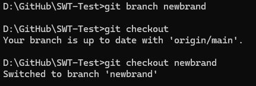

# SWT-Test

Dieses Repository dient als kleiner Test für mein Softwaretechnik Modul

## 1. Repository erstellen

Erstellen Sie sich ein Repository in GitHub oder GitLab.

## 2. Projekt hochladen

Pushen Sie ein eigenes Projekt von Ihnen hoch (z.B. das CCD-Projekt) oder erstellen Sie ein neues Projekt!

## 3. Git-Kommandos anwenden

Wenden Sie alle in den Unterlagen genannten relevanten Methoden beweisbar an: (das GitHub Repo ist Beweis) `push`, `pull`, `add`, `commit`, `diff`, `status`, `rm/mv`, etc.

### Git-Kommandos im Detail

- `git pull`:
  
- `git status` nach Änderung:
  
- `git status` nach `git add .`:
  
- `git commit` (BookTest):
  
- `git push` zum Hochladen der Änderungen:
  
  

## 4. Experimentieren Sie mit Zeitreisen!

Zeitreisen kann man durch bestimmte Commit-Hashes (`git log`) ermöglichen, um auf diesen Stand der Arbeit zurückzukehren. Mit `git checkout <commit-hash>` erlangt man den gewählten Commit.

Beide Schritte können auch schneller durch `git reset --hard <commit-hash>` erleichtert werden.

## 5. Branching und Merging

Erstellen Sie zwei unterschiedliche, aber ähnliche Branches, wechseln Sie hin und her und mergen Sie diese Branches dann wieder!

## 6. Pull Request erstellen

Erstellen Sie in GitHub einen kleinen Pull-Request bezugnehmend auf [dieses Repository](https://github.com/edlich/education)! (z.B. etwas kleines, nützliches, witziges, etc.)

